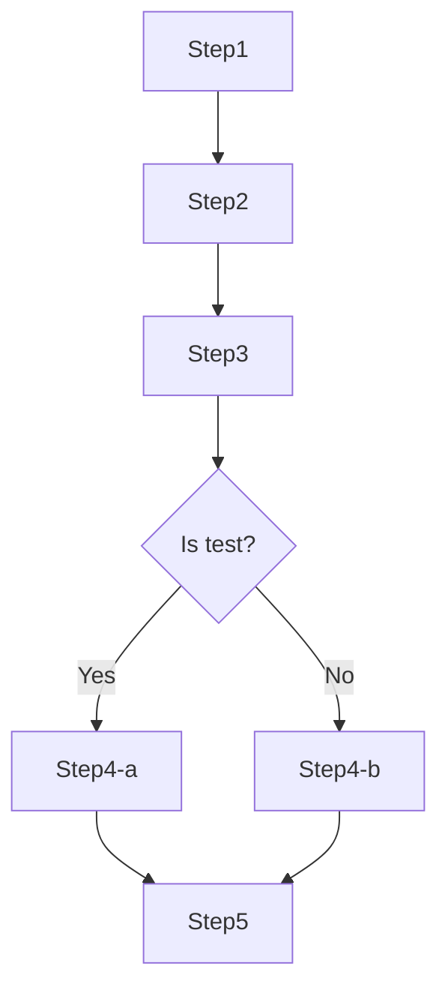
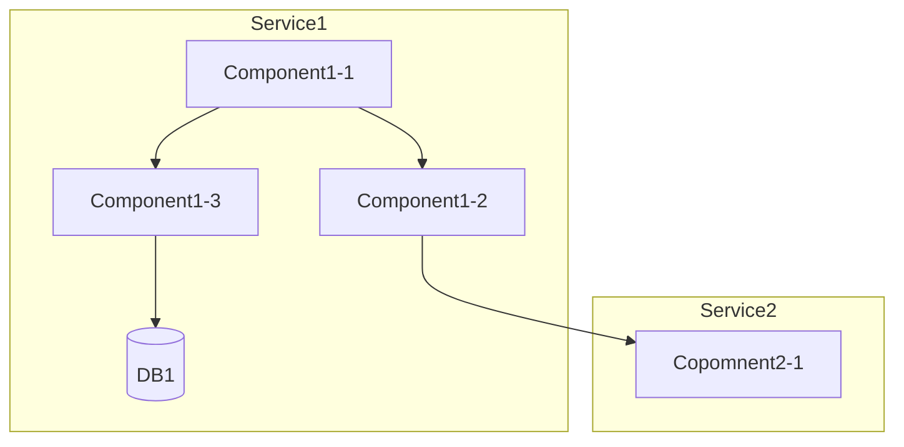

# Flowchart
## Normal flowchart

```mermaid
flowchart
    Step1 --> Step2
    Step2 --> Step3
    Step3 --> branch1{Is test?} 
    branch1 -- Yes --> Step4-a
    branch1 -- No --> Step4-b   
    Step4-a --> Step5
    Step4-b --> Step5
```
## Component diagram

```mermaid
flowchart
    subgraph Service1
        Component1-1 --> Component1-2 
        Component1-1 --> Component1-3
        Component1-3 --> id[(DB1)]
    end
    Component1-2 --> Copomnent2-1
    
    subgraph Service2
        Copomnent2-1
    end
```