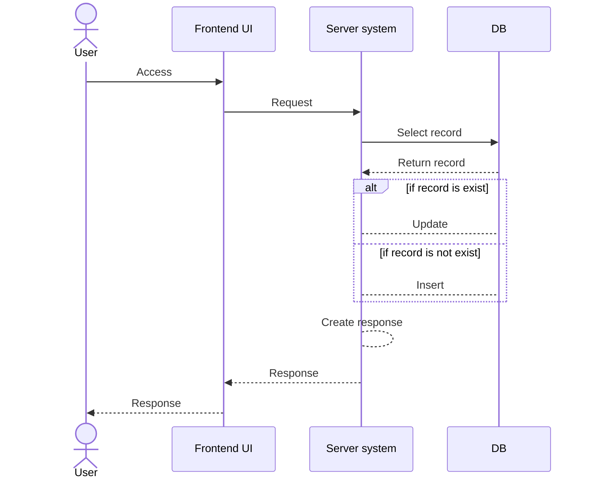

# Sequence

```mermaid
sequenceDiagram
    actor user as User
    participant ui as Frontend UI 
    participant server as Server system
    participant db as DB

    user ->> ui: Access
    ui ->> server: Request
    server ->> db: Select record
    db -->> server: Return record
    alt if record is exist 
        server --> db: Update
    else if record is not exist
        server --> db: Insert
    end 
    server --> server: Create response
    server -->> ui: Response 
    ui -->> user: Response
```