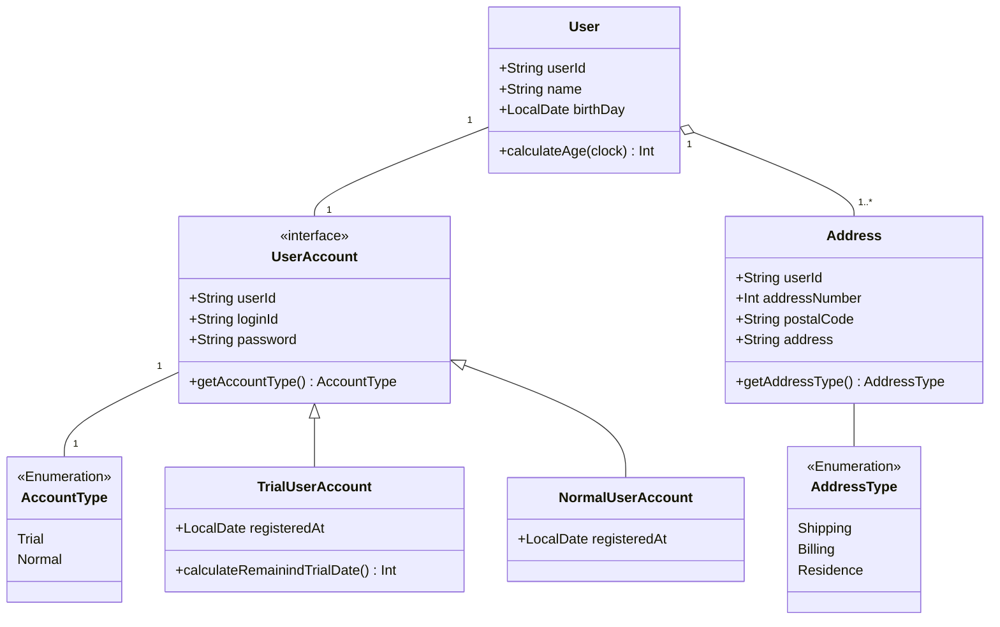

# Class

```mermaid
classDiagram
    class User {
        +String userId
        +String name
        +LocalDate birthDay
        +calculateAge(clock) Int
    }
    User "1" -- "1" UserAccount
    UserAccount "1" -- "1" AccountType
    class UserAccount {
        <<interface>>
        +String userId
        +String loginId
        +String password
        +getAccountType() AccountType
    }
    
    UserAccount <|-- TrialUserAccount
    class TrialUserAccount {
        +LocalDate registeredAt
        +calculateRemainindTrialDate() Int
    } 
    UserAccount <|-- NormalUserAccount
    class NormalUserAccount {
        +LocalDate registeredAt
    }

    class AccountType {
        <<Enumeration>>
        Trial
        Normal
    }

    User "1" o-- "1..*" Address
    class Address {
        +String userId
        +Int addressNumber
        +String postalCode
        +String address
        +getAddressType() AddressType
    }

    Address -- AddressType
    class AddressType {
        <<Enumeration>>
        Shipping
        Billing
        Residence
    }
```