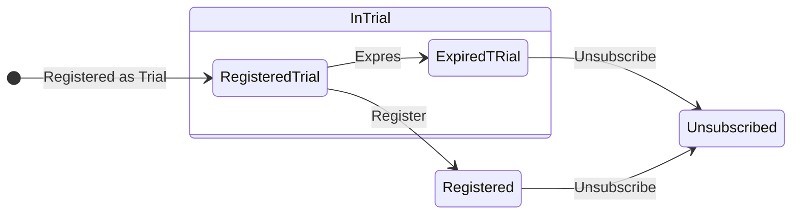

# State

```mermaid 
stateDiagram-v2 
    direction LR
    [*] --> RegisteredTrial: Registered as Trial
    state InTrial {
        RegisteredTrial --> ExpiredTRial: Expres
    }

    RegisteredTrial --> Registered: Register
    ExpiredTRial --> Unsubscribed: Unsubscribe
    Registered --> Unsubscribed: Unsubscribe

```